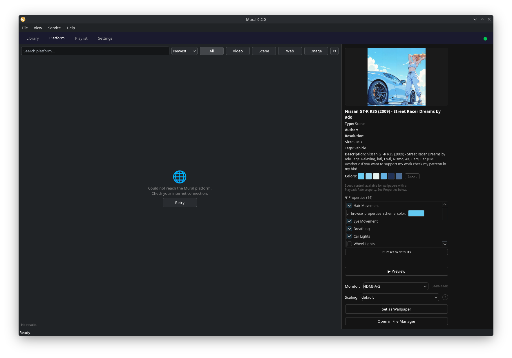
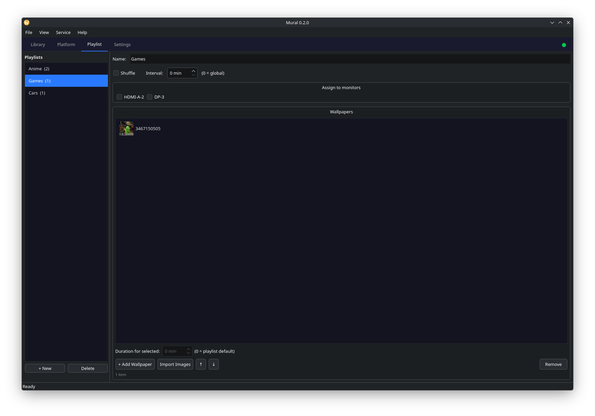
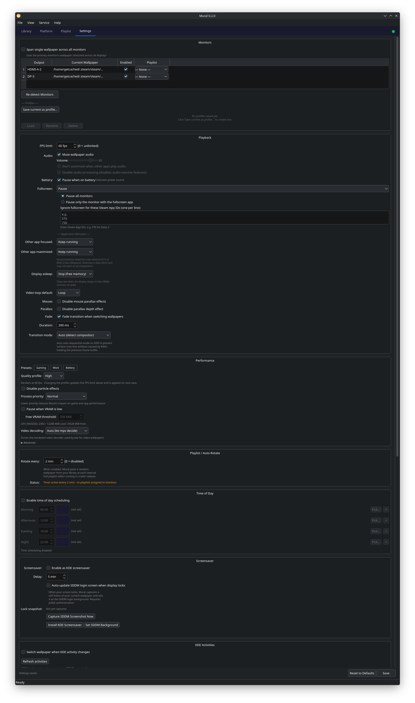
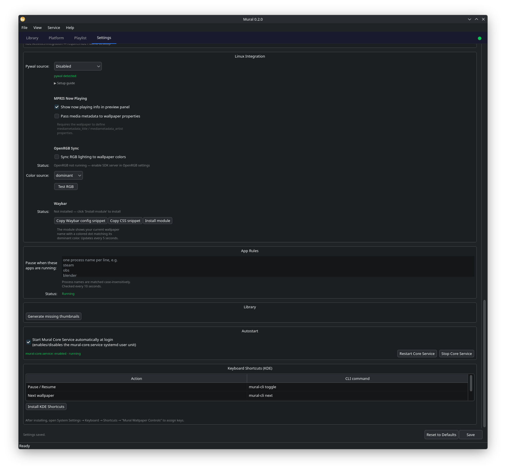

MURAL - README
==============

Mural is an open source animated wallpaper platform for Linux.
Set video, scene, and web-based animated wallpapers on your desktop
with a community content library, session persistence, native desktop
environment integration, and Linux-native ricing tools — no terminal
required after install.

Built for the Linux desktop Wallpaper Engine always refused to support.

---

PROJECT STATUS
--------------
Version: 0.2.0
Primary Target: KDE Plasma 6 (Wayland + X11)
Rendering Backend: linux-wallpaperengine by Almamu
GUI Framework: Python 3.11+ / PySide6
License: GPL v3

---

FEATURES (v0.2.0)
------------------------

WALLPAPER PLAYBACK
- Animated wallpaper playback: video (MP4, WebM), scene-based, web-based
- Multi-monitor support with independent per-monitor wallpaper assignment
- Per-monitor scaling: Default, Stretch, Fill, Fit — persisted per wallpaper
- Screen span: single wallpaper stretched across all monitors
- Auto-detection of desktop environment, compositor, and session type
- Session persistence: wallpaper survives GUI close via systemd user service
- Fullscreen pause: configurable per-condition (keep/pause/stop)
- Other app focused / maximized pause with KWin D-Bus detection
- Display sleep detection: stops lwe automatically to free VRAM
- FPS cap, volume slider, audio mute per session
- No automute option: keep wallpaper audio when other apps play
- Disable audio processing: turns off audio-reactive features
- Disable particles, disable mouse parallax, disable parallax depth
- Texture clamping mode: clamp / border / repeat
- Video loop mode per wallpaper: loop / no loop / ping-pong
- Per-wallpaper animation speed slider: 0.25x to 2.0x
- Video hardware acceleration: Auto / NVDEC / VAAPI / Disabled
- Process priority: Normal / Below normal / Idle (nice values)
- Transition mode: Auto (detects KDE/non-KDE) / Sequential / Overlap
- Fade overlay transition: configurable duration, fires at peak black
- XDG_SESSION_TYPE auto-inference for Wayland/X11

LIBRARY
- Browse 700+ local Wallpaper Engine workshop files with thumbnail previews
- Thumbnails loaded from project.json preview field, GIF-capable
- Full metadata: title, author, resolution, file size, tags, description
- Parsed from each wallpaper's project.json automatically
- Symlink-aware Steam path deduplication (resolves ~/.steam symlinks)
- Type filter buttons: All, Video, Scene, Web, Image
- Dynamic tag chip filters: populated from library, AND-combined with type
- Search by wallpaper name
- Clear filters resets all axes at once
- Right-click wallpaper → Add to Playlist
- Aspect ratio mismatch indicator: warns when 16:9 wallpaper on ultrawide
- Property editor: per-wallpaper sliders, toggles, color pickers from project.json
- ⚙ badge on cards that have saved property overrides
- ↔ flip indicators on cards with saved flip state
- Live preview window: ▶ Preview button opens wallpaper in a floating window

PLAYLIST SYSTEM
- Create and name multiple playlists
- Add wallpapers from library via right-click, Add button, or drag-and-drop
- Import entire folders of images with count confirmation
- Per-playlist shuffle mode (⇌ indicator)
- Per-playlist rotation interval (overrides global setting)
- Per-wallpaper duration override with spinbox
- Drag-and-drop reorder within playlist
- Right-click context menu: Remove, Move to top, Move to bottom
- Assign playlists to specific monitors independently
- Global auto-rotate timer with per-playlist interval support
- Empty state message with guidance
- Wallpaper count badge on each playlist

SETTINGS
- Power profiles: Gaming, Work, Battery presets populate all settings
- Per-monitor playlist assignment in monitors table
- Multi-monitor profiles: save/load/delete named monitor assignment snapshots
- Battery auto-pause with AC/battery status display
- Application rules: pause when specified process names are running
- Per-condition behavior: focused / maximized / fullscreen (keep/pause/stop)
- Display sleep: stop lwe when monitor goes to sleep
- VRAM exhaustion pause: monitors GPU memory via nvidia-smi / rocm-smi
- GPU memory live display in Settings
- Coordinated pause: all pause reasons share a set, resumes only when all clear
- Autostart: enable/disable mural-core.service systemd unit
- Re-detect monitors button
- Time-of-day schedule: four configurable wallpaper slots
- Screensaver mode: installs KDE screensaver entry
- SDDM login background: auto-update on screen lock via pkexec
- KDE Activities sync: per-activity wallpaper assignment
- Process priority control for lwe subprocess

LINUX RICING INTEGRATION
- Color palette extraction: 6 dominant HEX colors via Pillow
- Clickable swatches in preview panel — click to copy HEX
- Export palette to ~/.cache/mural/current_palette.json for scripts/Waybar
- Pywal integration: run wal on wallpaper change, primary or last-changed monitor
- Matugen integration: Material You theming via matugen image <path>
- Hyprland IPC sync: set active/inactive border colors via Unix socket
- OpenRGB sync: set all RGB devices to dominant wallpaper color
- OpenRGB color source: dominant / secondary / tertiary / average
- Waybar module: colored dot + wallpaper name, reads current_palette.json
- MPRIS now-playing: album art, title, artist in preview panel

MURAL CLI (mural-cli)
- mural-cli set <path> [--monitor <name>] [--scaling <mode>]
- mural-cli get [--monitor <name>]
- mural-cli next / mural-cli random [--tag] [--type]
- mural-cli pause / mural-cli resume / mural-cli toggle
- mural-cli status / mural-cli monitors / mural-cli palette
- mural-cli profile save <name> / load <name> / list
- mural-cli hyprland-sync / mural-cli openrgb-sync
- Scriptable from Hyprland keybinds, shell scripts, Waybar

PERFORMANCE & STABILITY
- Single-instance guard: psutil prevents multiple lwe processes
- SIGTERM → wait → SIGKILL: clean Wayland surface release
- KDE sequential transition: kill old lwe before starting new (no surface conflict)
- 100ms compositor sleep after kill: KWin surface cleanup
- Intentional stop flag: switches don't burn crash-restart budget
- Interruptible backoff: stop/start cancels pending restart timer
- Orphan cleanup on every start
- lwe stderr captured and logged to journal
- Steam symlink deduplication: resolves ~/.steam → ~/.local/share/Steam

---

PLANNED
-------
- Hyprland / wlroots compositor support (wlr-layer-shell)
- XFCE support (X11 root window)
- GNOME Shell extension support
- Flatpak distribution via Flathub
- Mural content platform (browse + download community wallpapers)
- Audio-reactive wallpapers via PipeWire
- SteamOS / Steam Deck / TV mode
- lwe upstream contributions: --msaa, --no-shadows, --no-reflections flags
- NixOS / Fedora packaging

---

SUPPORTED DESKTOP ENVIRONMENTS
-------------------------------
v0.2.0 (current):
  KDE Plasma 6       SUPPORTED (Wayland + X11)

Planned:
  Hyprland           IN PROGRESS (wlr-layer-shell, mural-cli works today)
  Sway               PLANNED
  XFCE               PLANNED
  GNOME              PLANNED (technically difficult, lower priority)

Auto-detection via $XDG_CURRENT_DESKTOP and $XDG_SESSION_TYPE at launch.

---

REQUIREMENTS
------------
Required:
  - Linux (Arch-based recommended for v1)
  - KDE Plasma 6 (other DEs planned)
  - Python 3.11 or higher
  - linux-wallpaperengine-git (AUR)
  - python-gobject (system package — pacman -S python-gobject)

Optional:
  - Steam + Wallpaper Engine: for local Workshop file compatibility
  - python-pywal: system color scheme integration
  - matugen: Material You color scheme (popular with Hyprland/niri)
  - openrgb: RGB hardware sync (enable SDK Server in OpenRGB settings)
  - waybar: Waybar module support
  - nvidia-utils or rocm-smi: GPU memory monitoring

---

INSTALLATION
------------

AUR (Arch, CachyOS, Manjaro, EndeavourOS):
  paru -S mural-git
  # or: yay -S mural-git

AppImage (any Linux distro):
  # Download from GitHub Releases
  wget https://github.com/ian-vinson/mural/releases/download/v0.2.0/Mural-0.2.0-x86_64.AppImage
  chmod +x Mural-0.2.0-x86_64.AppImage
  ./Mural-0.2.0-x86_64.AppImage

  Requires on host system:
    - linux-wallpaperengine  (paru -S linux-wallpaperengine-git)
    - python-gobject          (sudo pacman -S python-gobject)

  Build it yourself:
    bash scripts/build-appimage.sh
    # Output: dist/Mural-0.2.0-x86_64.AppImage

Flatpak (any Linux distro with Flatpak):
  # Not yet on Flathub — build locally for now:
  # See flatpak/README.md for full instructions.
  flatpak-builder --user --install --force-clean \
      /tmp/mural-flatpak-build \
      flatpak/io.github.ian_vinson.Mural.yml
  flatpak run io.github.ian_vinson.Mural

  # Once on Flathub:
  flatpak install flathub io.github.ian_vinson.Mural

Manual:
  # 1. Install linux-wallpaperengine
  paru -S linux-wallpaperengine-git

  # 2. Install system Python dependency
  sudo pacman -S python-gobject

  # 3. Clone and install
  git clone https://github.com/ian-vinson/mural.git
  cd mural
  ./install.sh

  # 4. Launch
  mural

Optional integrations:
  sudo pacman -S python-pywal    # pywal theming
  paru -S matugen                # Material You theming
  # Enable both in Settings → Linux Integration

---

HOW IT WORKS
------------

Three components work together:

1. MURAL GUI (PySide6)
   The main application window. Browse wallpapers, manage playlists,
   configure settings. Closing the window does NOT stop your wallpaper.

2. MURAL CORE SERVICE (systemd user service: mural-core.service)
   Runs headlessly in your login session. Owns the wallpaper lifecycle —
   applies wallpapers, handles multi-monitor assignments, runs playlists,
   pauses on fullscreen/battery/sleep, restores on login.
   Communicates with the GUI via D-Bus (org.mural.Core).

3. LINUX-WALLPAPERENGINE (subprocess)
   C++ rendering engine by Almamu. Mural manages it entirely — you never
   interact with it directly.

   [Mural GUI] <──D-Bus──> [mural-core service] <──subprocess──> [lwe]
                                   │
                        [DE Adapter Layer]
                        ├── KDE Plasma plugin
                        ├── wlr-layer-shell [planned]
                        └── X11 root window [planned]

---

RICING WORKFLOW
---------------

1. Select a wallpaper in Library → color swatches appear in preview panel
2. Click any swatch to copy its HEX code
3. Click Export → writes ~/.cache/mural/current_palette.json
4. Use in Waybar, Hyprland, Rofi:
     cat ~/.cache/mural/current_palette.json
5. Enable pywal in Settings → Linux Integration → auto-themes terminal
6. Enable matugen for Material You theming on Hyprland/niri
7. Enable Hyprland IPC sync → border colors match wallpaper automatically

Palette JSON format:
  {
    "colors": ["#1a1a2e", "#2d1b5e", "#4a3080", "#6b4ca0", "#8d6cc0", "#b09ae0"],
    "wallpaper": "/path/to/wallpaper/directory",
    "name": "Cosmic Drift"
  }

Waybar module — add to ~/.config/waybar/config:
  "custom/mural": {
      "exec": "~/.local/share/mural/waybar/mural-waybar.py",
      "interval": 5,
      "return-type": "json"
  }

Hyprland keybinds using mural-cli:
  bind = $mod, W, exec, mural-cli random --type scene
  bind = $mod SHIFT, W, exec, mural-cli next
  bind = $mod ALT, W, exec, mural-cli toggle

---

WALLPAPER SOURCES
-----------------

LOCAL FILES
  File → Add Folder to add any directory of MP4s, images, or
  linux-wallpaperengine scene directories.

STEAM WORKSHOP (local files only)
  Mural auto-discovers downloaded Workshop wallpapers.
  Requires Steam + Wallpaper Engine installed locally.
  Mural does NOT download from Steam Workshop directly.

MURAL PLATFORM
  Browse and download community wallpapers (coming soon).
  Free to use, no account required to download.

---

KNOWN LIMITATIONS
-----------------

lwe compatibility errors:
  Some Scene wallpapers use rendering features not yet implemented in
  linux-wallpaperengine and will fail to display.  Common error patterns
  seen in `journalctl --user -u mural-core.service -f`:

    "Failed to load model: solidlayer"
      → Wallpaper uses a 3-D solid-layer model.  No workaround; skip it.

    "Unknown shader type: X"
      → Wallpaper uses a newer shader node type.  No workaround; skip it.

    "GLFW error 65548: Wayland: The platform does not support setting
     the window position"
      → Harmless Wayland positioning warning; suppressed in the preview
        panel but may appear in the service journal.  No action needed.

    "Failed to initialize GLEW"
      → Usually appears alongside the GLFW error above.  Harmless.

  Mural marks library cards with an amber ⚠ badge when it detects a
  newer scene package format (PKGV > 0008) that is likely to trigger
  rendering errors.

Scene package format (PKGV):
  Wallpaper Engine packs scene assets into a `scene.pkg` binary whose
  format version is stored in the file header as "PKGVnnnn" (e.g.
  "PKGV0012").  linux-wallpaperengine currently supports up to PKGV0008.
  Wallpapers with a higher version number may render incorrectly or not
  at all.  Video (`type: video`) and web (`type: web`) wallpapers do not
  use `scene.pkg` and are unaffected by this limit.

  To check a wallpaper's package version manually:
    python3 -c "
    import sys; f=open(sys.argv[1],'rb'); f.seek(8); print(f.read(8))
    " /path/to/wallpaper/scene.pkg

Zoomed or cropped wallpapers:
  Wallpapers designed for 16:9 may appear zoomed or cropped on ultrawide
  monitors.  Mural shows an amber ↔ indicator on library cards that have
  a non-standard aspect ratio.

  Fix: select the wallpaper → change Scaling to "Fill" or "Fit" in the
  preview panel.  This setting is saved per wallpaper and applied every
  time that wallpaper is activated.

Animation speed control:
  The ⚡ Playback Rate slider in the Properties panel is only shown when
  the wallpaper's `project.json` defines a property with a key containing
  "rate", "speed", or "playback".  For wallpapers that lack this property
  there is no speed control — this is an lwe limitation.

Global rendering quality:
  Anti-aliasing, shadows, reflections, and post-processing are not
  exposed by lwe as command-line flags and cannot be configured from
  Mural.  These require upstream lwe changes.  FPS cap and particle
  disable are available as partial workarounds.

---

CONTRIBUTING
------------
Key areas needing help:
  - Hyprland/wlroots adapter (wlr-layer-shell integration)
  - GNOME Shell extension adapter
  - XFCE X11 root window adapter
  - lwe upstream: --msaa, --no-shadows, --no-reflections flags
  - Mural content platform backend
  - UI/UX improvements
  - Wallpaper compatibility testing

  git clone https://github.com/ian-vinson/mural.git
  cd mural
  pip install -r requirements-dev.txt
  # See DEVGUIDE.txt for full architecture and setup

---

RELATED PROJECTS
----------------
- linux-wallpaperengine by Almamu
  https://github.com/Almamu/linux-wallpaperengine

- wallpaper-engine-kde-plugin by catsout
  https://github.com/catsout/wallpaper-engine-kde-plugin

- pywal by dylanaraps
  https://github.com/dylanaraps/pywal

- matugen by InioX
  https://github.com/InioX/matugen

- Variety Wallpaper Changer
  https://github.com/varietywalls/variety

---

WHY MURAL?
----------
Wallpaper Engine has 30 million users on Windows and explicitly refuses
to support Linux. The Linux community has the rendering engine (lwe),
the KDE plugin, the pywal tooling — but nothing that assembles these
into a product that works out of the box, persists across sessions, and
integrates with the Linux ricing ecosystem.

Mural is that product.

---

LICENSE
-------
Mural: GNU General Public License v3.0 — see LICENSE
Mural platform API: MIT — see platform/LICENSE

---

ACKNOWLEDGEMENTS
----------------
- Almamu and linux-wallpaperengine contributors
- catsout and CaptSilver for wallpaper-engine-kde-plugin
- dylanaraps for pywal
- InioX for matugen
- The KDE team for Plasma 6 documentation
- r/unixporn for keeping Linux desktop customization alive
